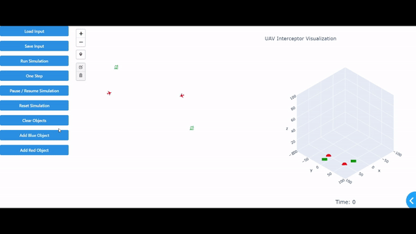

# UAV Interceptor Visualization

This project visualizes UAV interceptor simulations using Dash and Plotly. It includes both 3D and 2D maps to display the positions and movements of blue and red objects in the simulation.

<div align="center">
    
</div>
## Features

- **3D Map**: Visualizes the UAVs and their launch sites in a 3D space.
- **2D Map**: Provides a 2D view of the UAVs and their launch sites.
- **Interactive Controls**: Allows adding blue and red objects by clicking on the 2D map.
- **Simulation Controls**: Includes buttons to run, pause, reset, and step through the simulation.

## Installation

1. Clone the repository:
    ```sh
    git clone https://github.com/AlmogHadad/GMOP.git
    cd GMOP
    ```

2. Install the required dependencies:
    ```sh
    pip install -r requirements.txt
    ```

## Usage

1. Run the Dash application:
    ```sh
    python main.py
    ```

2. Open your web browser and navigate to `http://127.0.0.1:8051`.

## Project Structure

- `visualization/dash_main_page.py`: Main script to run the Dash application.
- `simulation_manager.py`: Manages the simulation environment and objects.
- `red_object.py`: Defines the `RedObject` class.
- `blue_object.py`: Defines the `BlueObject` class.

## Adding Objects

- **Add Blue Object**: Click the "Add Blue Object" button and then click on the 2D map to place a blue object.
- **Add Red Object**: Click the "Add Red Object" button and then click on the 2D map to place a red object.

## Simulation Controls

- **Run Simulation**: Click the "Run Simulation" button to start the simulation.
- **Pause Simulation**: Click the "Pause Simulation" button to pause the simulation.
- **Reset Simulation**: Click the "Reset Simulation" button to reset the simulation.
- **One Step**: Click the "One Step" button to advance the simulation by one step.

## License

This project is licensed under the MIT License. See the `LICENSE` file for details.
